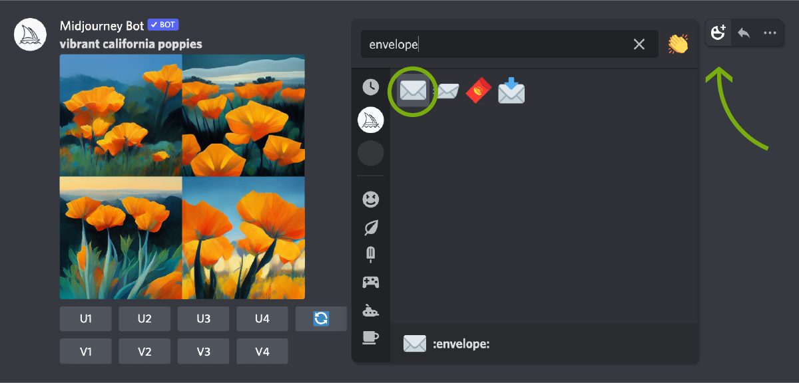
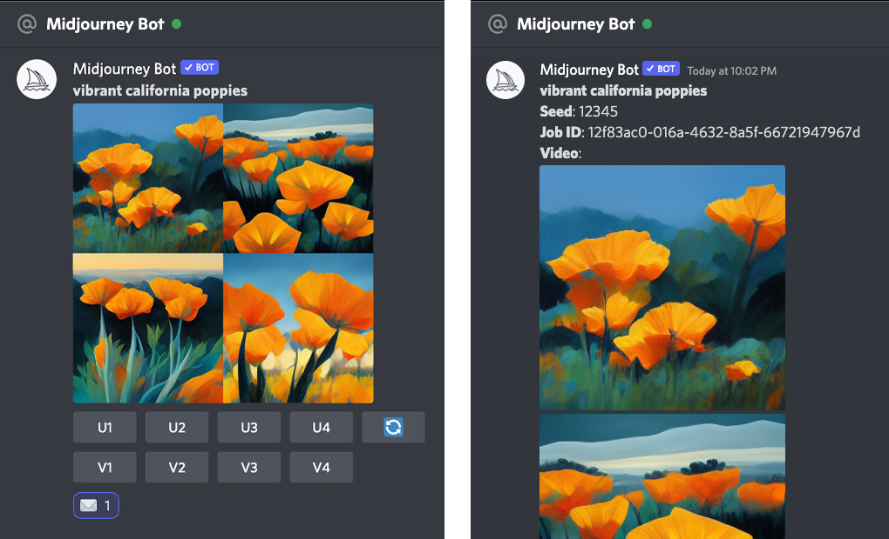

#### 你可以使用不同的表情符号来与Midjourney Jobs进行交互。以下是可以使用的表情符号及其对应的操作：

发送图片到你的直接消息中：
* 使用📩（信封）表情符号：转发消息到私人频道。
* 取消任务：使用❌（红色X）表情符号。
* 删除图片：使用🗑️（垃圾桶）表情符号。
通过对Midjourney Jobs的操作馈，你可以轻松地控制哪些图像被发送和删除。

  

---

  

✉️ 反应仅适用于你自己的作业。

