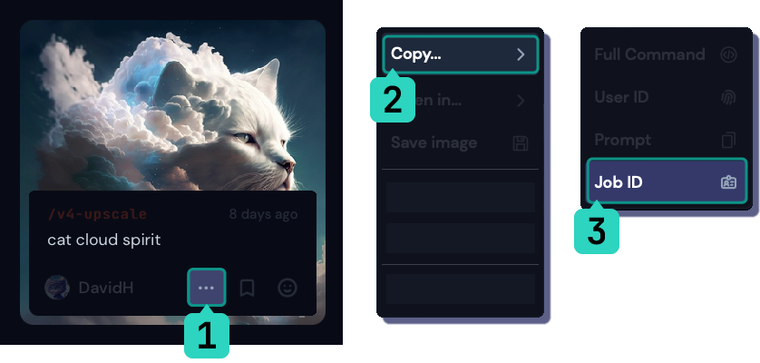
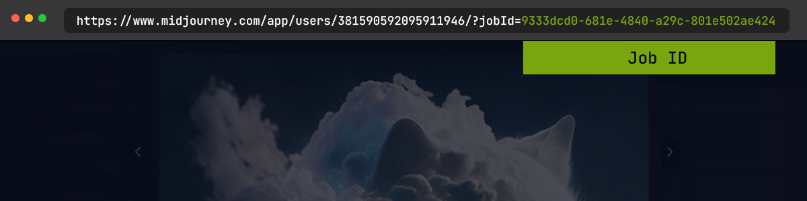
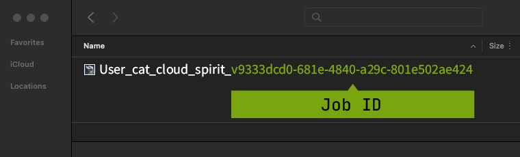
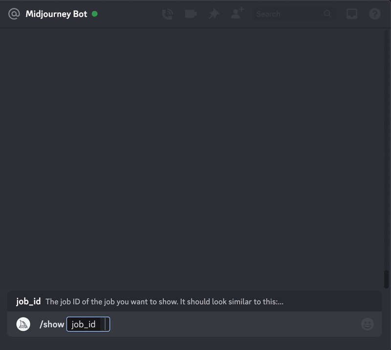

您可以使用 `/show` 命令和唯一的 Job ID 将你的作业进行移动到另一个服务器或频道，恢复丢失的作业，或刷新旧作业以制作新变体、升级或使用较新的参数和功能。

`/show` 仅适用于您自己的作业。

您可以使用唯一的Job ID 和 `/show `命令来将作业移动到另一个服务器或频道，恢复丢失的作业，或刷新旧作业以生成新的变化、升级或使用更高级的参数和功能。

`/show` 命令仅适用于您自己的作业。

* * *

Find a Job ID-找到你的作业ID
-------------

Job IDs are unique identifiers used for each image generated by Midjourney.  
Job IDs look like this: `9333dcd0-681e-4840-a29c-801e502ae424`and can be found in the first part of all image filenames, in the URLs on the website, and in an image's filename.

Job ID 是 Midjourney 生成的每个图像使用的唯一标识符。作业 ID 的格式类似于：9333dcd0-681e-4840-a29c-801e502ae424，可以在所有图像文件名的第一部分、网站上的 URL 和图像文件名中找到。

### On The Web-如何在网页上查找Job ID

您可以通过选择 `... >` `Copy... >` `作业 ID` 来在你作品库中找到任何图像的作业 ID。

### From The URL-从URL中查找Job ID

你可以再打开作品的网页链接末尾找到Job ID

**https://www.midjourney.com/app/users/381590592095911946/?jobId=9333dcd0-681e-4840-a29c-801e502ae424.**

### From The File Name-在文件名中查找

当您查看从库中下载的图像时，Job ID 在文件名的最后一部分。

**User_cat_cloud_spirit_9333dcd0-681e-4840-a29c-801e502ae424.png**

### [使用Discord的 Emoji转发消息](https://docs.midjourney.com/v1/docs/discord-emoji-reactions)

使用表情符号 ✉️ 可以将已完成的作业发送到私信中。私信中将包括图像的seed号和作业 ID。✉️ 表情符号只适用于您自己的作业。

* * *

How to Use Show-如何使用Show命令
---------------

在任何一个频道使用 `/show <Job ID #>` 来查看指定作业.

**Bot Channels** are Discord channels where the Midjourney Bot has been permitted to process Slash Commands. On the official Midjourney Discord, all channels in the **Newcomer Rooms**, **Thread Channels**, **Themed Image Gen**, and **General Image Gen** categories are Bot Channels.

**Bot Channels机器人频道**是Midjourney 机器人可以处理斜线命令的 Discord 频道。在官方 Midjourney Discord 中，**Newcomer Rooms新手房间**、**Thread Channels线程频道**、**Themed Image Gen主题图像生成**和**General Image Gen通用图像生成**类别中的所有频道都是机器人频道。
