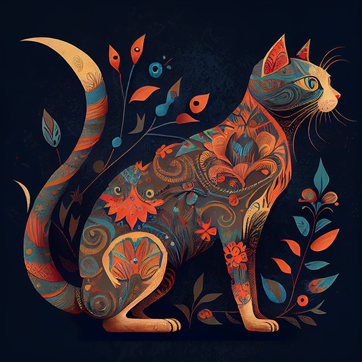
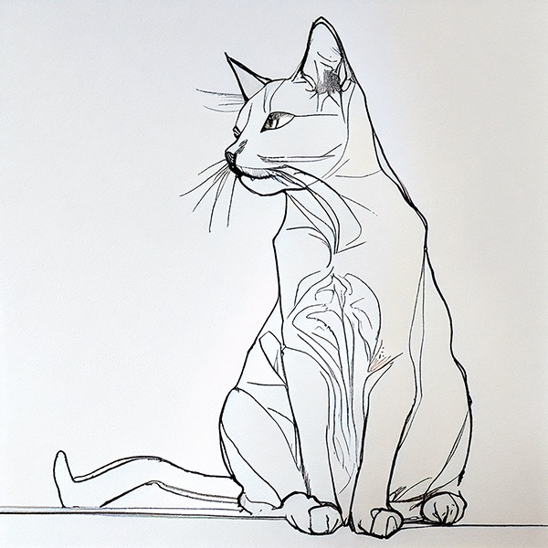
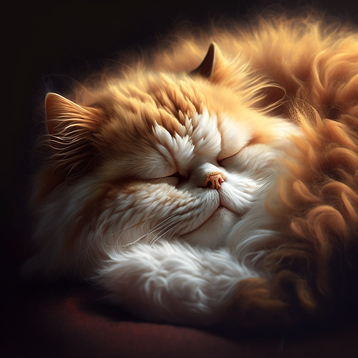
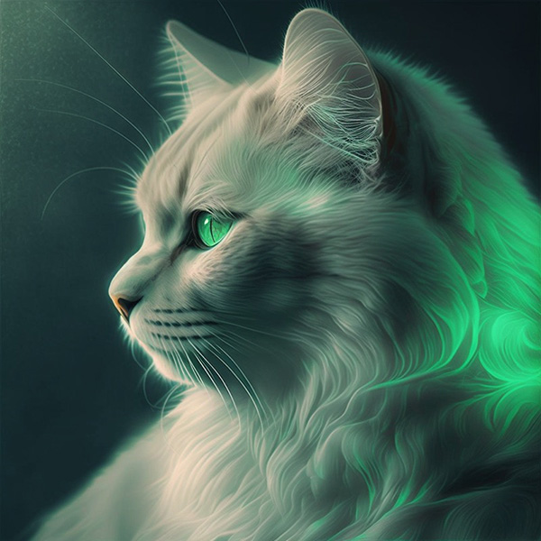

#### 即使是简短的单词提示，Midjourney的默认样式也能够生成美丽的图像，但是通过结合艺术形式、历史时期、地点等概念，您可以创建更加有趣和个性化的结果。

* * *

选择一种艺术形式
-------------

准备好颜料、蜡笔、刮画板、印刷机、闪粉、墨水和彩色纸吧！指定艺术形式是生成美图的最佳方式之一。

提示示例：`/imagine prompt` `<any art style> style cat`

<table border="0">
  <tr>
    <th>Block Print 木刻版画</th> <th>Folk Art 民间艺术</th> <th>Cyanotype 青色光敏蓝印</th> <th>Graffiti 涂鸦艺术</th>
  </tr>
  <tr>
    <td></td>
    <td></td>
    <td></td>
    <td></td>
  </tr>
</table>

<table border="0">
  <tr>
    <th>Paint-by-Numbers 数字油画</th> <th>Risograph 日光印刷</th> <th>Ukiyo 浮世绘</th> <th>Pencil Sketch 铅笔素描</th>
  </tr>
  <tr>
    <td></td>
    <td></td>
    <td></td>
    <td></td>
  </tr>
</table>
 

<table border="0">
  <tr>
    <th>Watercolor 水彩画</th> <th>Pixel Art 像素艺术</th> <th>Blacklight Painting 黑光画</th> <th>Cross Stitch 十字绣</th>
  </tr>
  <tr>
    <td></td>
    <td></td>
    <td></td>
    <td></td>
  </tr>
</table>

* * *

精确描述
------------

更精确的单词和短语可以帮助创造出完全符合您期望的内容和感觉的图片。

例如：`/imagine prompt` `<style> sketch of a cat`

<table border="0">
  <tr>
    <th>Life Drawing 素描写生</th>
    <th>Continuous Line 连续线条</th>
    <th>Loose Gestural 大手笔风格</th>
    <th>Blind Contour 盲画</th>
  </tr>
  <tr>
    <td></td>
    <td></td>
    <td></td>
    <td></td>
  </tr>
  <tr>
    <th>Value Study 明暗对比研究</th>
	<th>Charcoal Sketch 炭笔素描</th>
    <th></th>
    <th></th>
  </tr>
  <tr>
    <td></td>
    <td></td>
    <td></td>
    <td></td>
  </tr>
</table>

* * *

时期设定
-----------

不同的时期有不同的视觉分格
例如: `/imagine prompt` `<decade> cat illustration`

<table border="0">
  <tr>
    <th>1700s</th>
    <th>1800s</th>
    <th>1900s</th>
    <th>1910s</th>
  </tr>
  <tr>
    <td></td>
    <td></td>
    <td></td>
    <td></td>
  </tr>
  <tr>
    <th>1920s</th>
    <th>1930s</th>
    <th>1940s</th>
    <th>1950s</th>
  </tr>
  <tr>
    <td></td>
    <td></td>
    <td></td>
    <td></td>
  </tr>
</table>

<table border="0">
  <tr>
    <th>1960s</th>
    <th>1970s</th>
    <th>1980s</th>
    <th>1990s</th>
  </tr>
  <tr>
    <td></td>
    <td></td>
    <td></td>
    <td></td>
  </tr>
</table>
  

* * *

情感
-----

使用情感词语赋予结果个性化

例如: `/imagine prompt` `<emotion> cat`

<table border="0">
  <tr>
    <th>Determined 坚定的</th>
    <th>Happy 快乐的</th>
    <th>Sleepy 疲惫的</th>
    <th>Angry 生气的</th>
  </tr>
  <tr>
    <td></td>
    <td></td>
    <td></td>
    <td></td>
  </tr>
  <tr>
    <th>Shy 羞怯的</th>
    <th>Embarrassed 尴尬的</th>
    <th></th>
    <th></th>
  </tr>
  <tr>
    <td></td>
    <td></td>
    <td></td>
    <td></td>
  </tr>
</table>

  

* * *

色彩丰富
------------

使用多样的色彩描述赋予结果个性化

例如: `/imagine prompt` `<color word> colored cat`

  <table>
  <tr>
    <th>Millennial Pink 千禧粉</th>
    <th>Acid Green 酸橙绿</th>
    <th>Desaturated 去饱和度的</th>
    <th>Canary Yellow 淡黄色</th>
  </tr>
  <tr>
    <td></td>
    <td></td>
    <td></td>
    <td></td>
  </tr>
  <tr>
    <th>Peach 桃红色</th>
    <th>Two Toned 双色的</th>
    <th>Pastel 淡彩色</th>
    <th>Mauve 紫灰色</th>
  </tr>
  <tr>
    <td></td>
    <td></td>
    <td></td>
    <td></td>
  </tr>
  <tr>
    <th>Ebony 乌木色</th>
    <th>Neutral 中性的</th>
    <th>Day Glo 强光日光灯</th>
    <th>Green Tinted 绿色的色调</th>
  </tr>
  <tr>
    <td></td>
    <td></td>
    <td></td>
    <td></td>
  </tr>
</table>

* * *

赋予环境描述
------------------------

不同的环境描述赋予不一样的基调

例如: `/imagine prompt` `<location> cat`

<table border="0">
  <tr>
    <th>Tundra 冻原</th>
    <th>Salt Flat 盐沼</th>
    <th>Jungle 丛林</th>
    <th>Desert 沙漠</th>
  </tr>
  <tr>
    <td></td>
    <td></td>
    <td></td>
    <td></td>
  </tr>
  <tr>
    <th>Mountain 山</th>
    <th>Cloud Forest 云雾森林</th>
    <th></th>
    <th></th>
  </tr>
  <tr>
    <td></td>
    <td></td>
    <td></td>
    <td></td>
  </tr>
</table>

