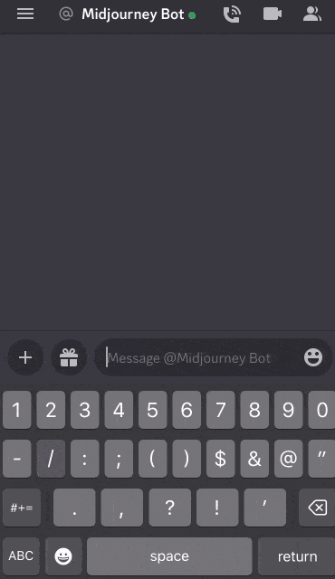

#### `/blend` 命令允许您快速上传 2-5 张图片，然后分析每张图片的美学概念，并将它们合并成一个新的独特的图像。

`/blend` 与使用 `/imagine` 的多个[图片提示](https://docs.midjourney.com/image-prompts)相同，但界面针对移动设备进行了优化，更易于使用。  
`/blend` 可以处理最多 5 张图像。如果要在提示中使用超过 5 张图像，请使用 `/imagine` 结合 [图片提示](https://docs.midjourney.com/image-prompts)。  
`/blend` 无法与文本提示一起使用。要同时使用文本和图像提示，请使用 `/imagine` 结合 [图片提示](https://docs.midjourney.com/image-prompts)。

* * *

`/blend` Options-可选参数
----------------

在输入 `/blend` 命令后，系统会提示您上传两张图片。从硬盘中拖放图片或在移动设备的照片库中添加图片。要添加更多图片，请选择 `optional/options` 字段，然后选择 `image3`、`image4` 或 `image5`。由于需要先上传图片，所以 `/blend` 命令可能比其他命令需要更长的启动时间。

混合图像默认具有 [1：1 的长宽比](https://docs.midjourney.com/v1/docs/aspect-ratios)，您可以使用可选的 `dimensions` 字段来选择正方形（1：1）、纵向（2：3）或横向（3：2）的长宽比。

 `/blend` 提示的结尾添加[自定义后缀](https://docs.midjourney.com/v1/docs/settings-and-presets)与 `/imagine` 命令一样。如果 `/blend` 命令中指定的长宽比与自定义后缀中的长宽比不同，则以 `/blend` 命令中指定的长宽比为准。

混合提示

为了获得最佳效果，请上传与您期望的结果相同宽高比的图像。

* * *

如何使用 `/blend`
-------------------

