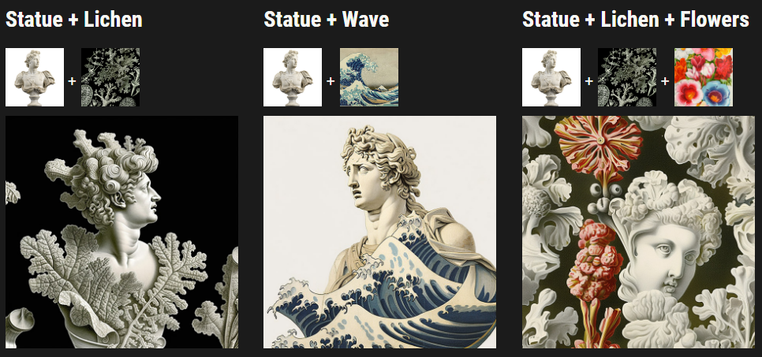

#### 在输入提示中使用图像来约束构图、风格和颜色。可将图片提示单独使用或与文本提示配合使用，尝试组合不同风格的图像会取得不一样的结果。选用与图像相关的文本提示也可能进一步增强结果的可预测性。.

要将图片添加到输入提示中，可以输入或粘贴图像存储网址。网址必须以.png、.gif 或 .jpg 这样的扩展名结尾。添加图像地址后，可以加入任何必要的文本和参数来完善输入提示。

* 图像提示应放在输入提示的开头。  
* 输入提示必须包含两个图像或一个图像和额外的文本信息才能开始作图。  
* 图像 URL 必须是在线图片的直接链接。  

[`/blend` 命令](https://docs.midjourney.com/blend) 是针对移动设备用户优化的图像提示过程。

* * *

上传图片到   Discord
--------------------------

参考过程

友情提示：不要上传你的照片或者别人的照片，注意意思，因为是公开的额

* * *

例子
--------

### 准备图片
||||
|-|-|-|
|Statue of Apollo|Vintage Flower Illustration|Ernst Haeckel's Jellyfish|
|||
|Ernst Haeckel's Lichen|Hokusai's The Great Wave|

### Midjourney Model Version 4

* * *

### Midjourney Model Version 5

* * *

Image 权重参数
----------------------

Use the image weight parameter `--iw` to adjust the importance of the image vs. text portion of a prompt. The default value is used when no `--iw` is specified. Higher `--iw` values mean the image prompt will have more impact on the finished job.

See the [Multi Prompts](https://docs.midjourney.com/multi-prompts) page for more information about the relative importance between parts of a prompt.

Different [Midjourney Version Models](https://docs.midjourney.com/models) have different image weight ranges.

使用图像权重参数 `--iw` 来调整提示中图像与文本部分的权重比。如果未指定 `--iw`，则使用默认值。较高的 `--iw` 值意味着图像提示将在作业中具有更大的权重。

有关提示各部分之间相对重要性的详细信息，请参见 [Multi Prompts](https://docs.midjourney.com/multi-prompts) 页面。

不同的 [Midjourney 版本模型](https://docs.midjourney.com/models) 具有不同的图像权重范围。

|              | Version 5 | Version 4 | Version 3 | Test / Testp | niji |
|--------------|-----------|-----------|-----------|--------------|------|
| Stylize 默认 | 1         | NA        | .25       | NA           | NA   |
| Stylize 范围 | .5–2      | NA        | -10000–10000 | NA         | NA   |

prompt example: `/imagine prompt` `flowers.jpg birthday cake --iw .5`
Image Prompt 参考图：

结果对比：

||||
|-|-|-|
|--iw .5|--iw .75|--iw 1|
||||
|--iw 1.25|--iw 1.75|--iw 1.5|
||
|--iw 2|
